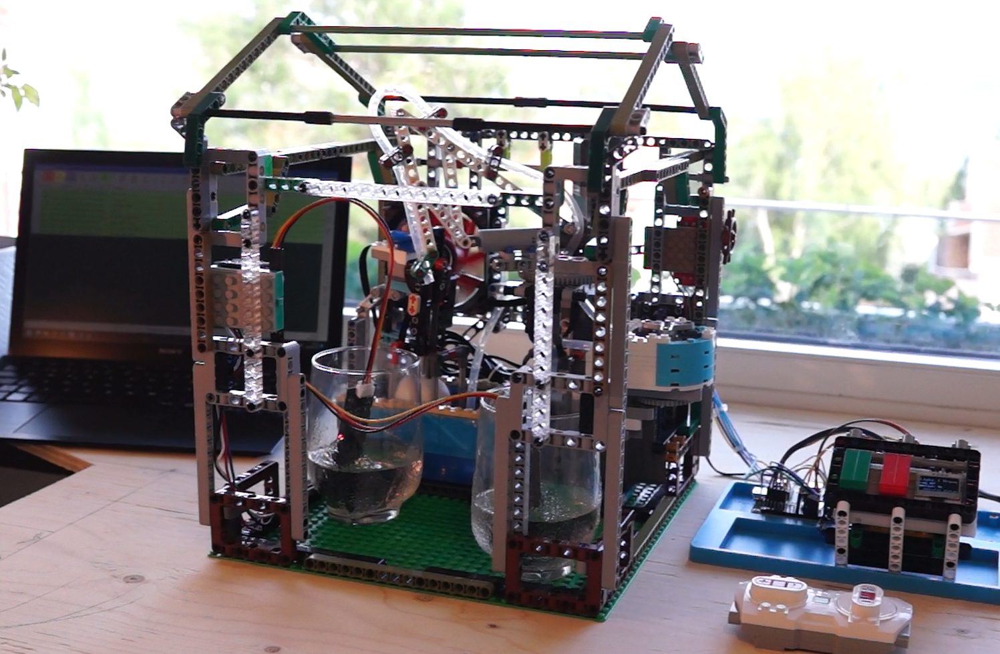
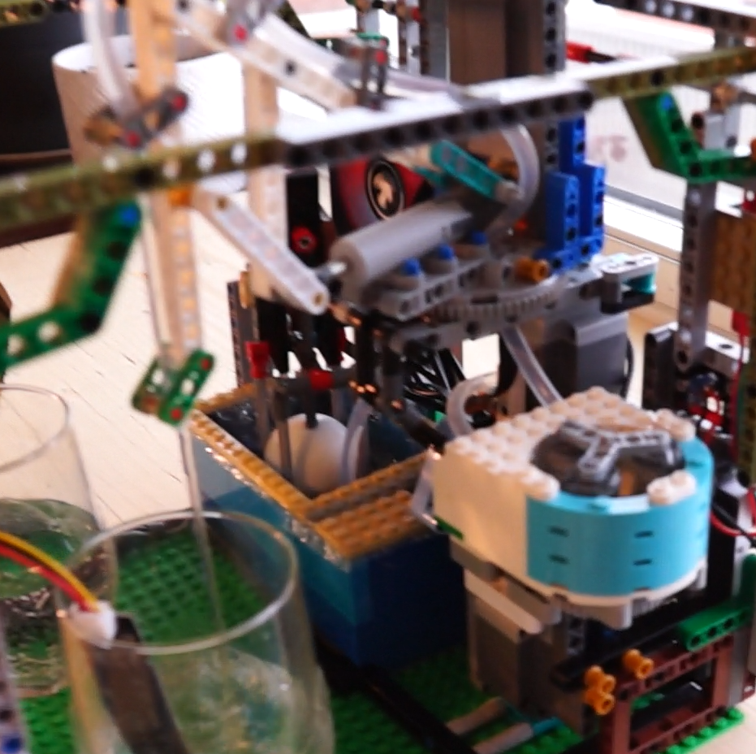
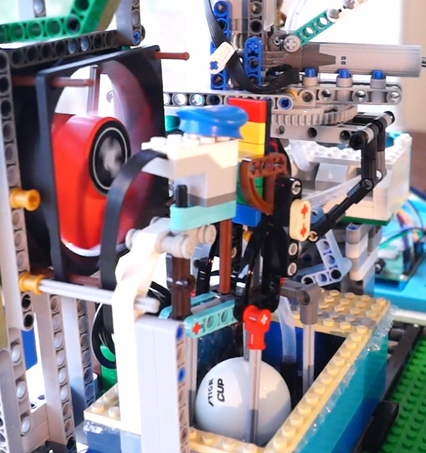
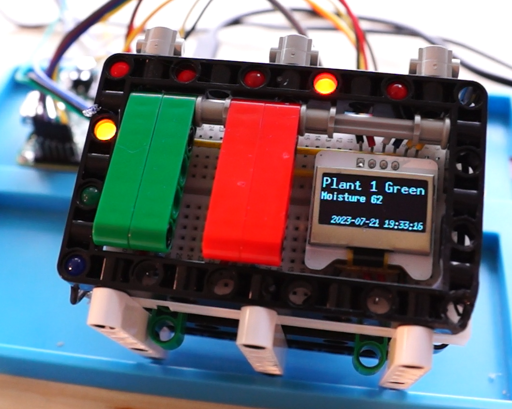
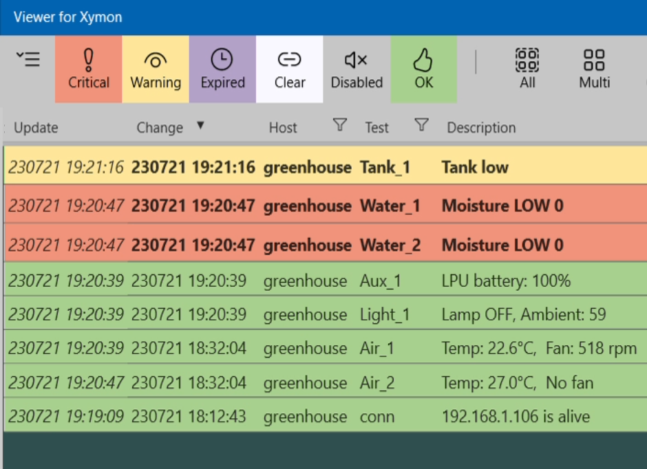
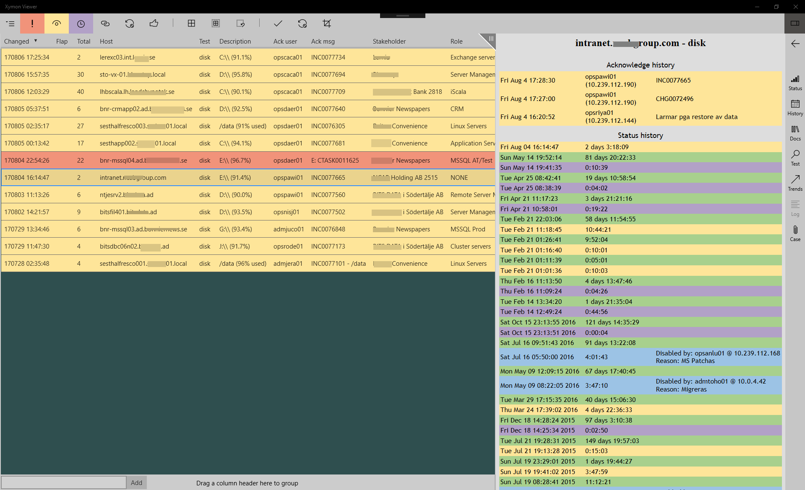

# Portfolio (SE)

## Rusty Grow

*Rust*

Hårdvaru-agnostiskt ramverk i Rust för automatiserade växthus av arbiträr storlek.

#### Drift 

* Fuktsensorstyrda bevattningsmekanismer, stationära eller rörliga i XYZ-led.
* Temperaturstyrda ventilationszoner
* Tidstyrda ljuszoner

#### Övervakning

* Larmkällor 
    - Hög / låg (resp. 3 nivåer): fuktnivå, temp, ljusnivå, vattenresarvoar
    - Felindikation (3 nivåer): vattenpump, rörlig bevattningsmekanism
* Statusindikation
    - Fjärrövervakning med [Xymon](https://xymon.sourceforge.io/)
    - Lamp-panel: Röd/gul/grön per larmkälla
    - Text-display
    

[Se kod](https://github.com/joakim000/grow)

### Implementation med Raspberry Pi och LEGO®
*Rust, [LEGO® Wireless Protocol](https://lego.github.io/lego-ble-wireless-protocol-docs/)*

För att demonstrera Rusty Grow-ramverket med minimal specifik hårdvara; ett växthus ink. rörlig bevattningsarm, vattennivåsensor och vattenpump byggt i Lego. Tillkommande hårdvara var 2 vätskesensorer och en datorfläkt, samt en LCD-display och några LED-lampor för kontrollpanelen. En Raspberry Pi tjänstgör som styrenhet.

 
*Översikt. Fjärrövervakning i bakgrunden. Handkontrollen används för att ställa in bevattningspositioner.* 

 

*Pantografarm på roterande bas för XY-positionering, peristaltisk pump. T.h. fläkt och vattenbehållare med nivåsensor.*

 

*Kontrollpanel med indikationslampor och display. T.h. statusövervakning med Xymon.*

[Se kod](https://github.com/joakim000/grow/tree/main/examples/rpi3)

## Bidrag till Rust-crate för LEGO® Powered UP

*Rust, [LEGO® Wireless Protocol](https://lego.github.io/lego-ble-wireless-protocol-docs/)*

Den existerande crate (funktionsbibliotek) för Rust-programmering med LEGO® Powered UP var på "proof-of-concept"-nivå i fråga om funktionalitet. Det kunde ansluta till en hub (styrenhet), tända hubbens inbyggda LED och och starta/stoppa  en ansluten motor. 
Efter mitt bidrag har craten funktionalitet att stödja komplexa och varierade projekt, med:
* Brett stöd för olika hubbar
* Brett stöd för inkopplade tillbehör (devices); sensorer, lampor, enkla motorer och motorer med sensor-feedback
* Anslutning till devices genom namn (tidigare endast hårdkodat port-ID)
* Omdesignad hårdvaru-abstraktion som förenklar att stödja ytterligare (och kommande) devices  

[Se kod](https://github.com/joakim000/lego-powered-up)

[Se PR]()

## Anslagstavlan

*HTML, JavaScript, PHP*

Skräddarsydd påminnelse / call-to-action-applikation för drift-avdelningen på Teracom (Sveriges terrestiella radio- och TV-utsändare).

[Live demo](https://joakim.dreamhosters.com/anslagstavlan_demo/)
 
[Användar-manual](https://joakim.dreamhosters.com/anslagstavlan_demo/help.html) 

*I användning:* 

## Viewer for Xymon

*C#, UWP*

UWP frontend for live monitoring with Xymon Monitor in the style of Netcool or Netrac. Batch ack/disable events, sorting, filtering, history, etc. Inline web ticketing.

* Direkt uppdatering larmbilden istället för minut-intervaller
* Avsevärd förbättring av överskådligheten genom sortering, filtrering, etc. (se jämförelse nedan)
* Integrerade vyer av detaljstatus, historik, nod-dokumentation, knuten ticket
* Semi-automatic ticketing
* Batch acknowledgement, disabling/enabling, ticketing
* Supports custom nodes with regular expression-based interpretation of messages

*Exempel-vy: Filter förvalda för röd, gul och lila status, historik-sidovy aktiverad*

### Jämförelse med Xymons standard-gränsnitt

| | VfX         | Xymon web interface |
|---| ----------- | ----------- |
|Uppdatering| Live | Upp till 60s fördröjning
|Sortering| Senast inkommet (alt. valfri kolumn) | Alfabetisk ordning       |
|Nytt aktivt larm | Djup färg (och/eller fetstil)| Färgad emoji-ikon        |
|Hanterat aktivt larm | Blek färg, med ansvarig och  hanterings-status i resp. kolumn | Färgad bock-ikon |
|Fel-meddelande| I meddelande-kolumn | Bakom länk till status-sida (Emoji- el. bock-ikon) |
|Historik| I sidovy | Historik-länk på status-sidan |
|Nod-dokumentation | I sidovy | Skriv el. klipp/klistra nodnamn till dokumentations-söksida |
|Skapa/uppdatera ticket | I sidovy | Skriv el. klipp/klistra nodnamn till ticket-söksida |

[Se kod](https://github.com/joakim000/Viewer-for-Xymon)

## CRC Explorer

*C*

Verktyg för studier / undervisning i CRC-felkodning, samt validerings-test av implementationer.

[Läs mer](https://github.com/joakim000/CRC_Explorer)

## TestApp by Unicus

*C#, WPF*

Ramverk för automatiserad regressionstestning.

* Test-motor och API för test-skript i C# eller Python
* Särskilt API-stöd för web-testning med [Selenium](https://www.selenium.dev/)
* Grafiskt konfigurations- och rapportgränsnitt (WPF)
* Kommmandorads-gränssnitt för te.x. schemalagd körning (med möjlighet till rapportering med epost)

[Se kod](https://github.com/joakim000/TestRunnerApp)

### Dokumentation

Som del av projektet producerade jag manualer - över API:et, för medarbetare som författar test-skript; samt för applikationen, för medarbetare eller kunder som kör tester och hanterar resultat.

* Testutvecklare: [Sätta upp miljö](assets/testapp_env.pdf), [API-tutorial](assets/testapp_api.pdf)
* Användare: [Grafisk applikation](assets/testapp_gui.pdf), [konsol-applikation](assets/testapp_konsol.pdf)

## Timeline of Composers

*HTML, JavaScript*

Sprunget ur en konversation om musik-historia, där vi hade önskat oss att se en tidslinje över när de kompositörer det talades om kompositörer levde och verkade. Detta blev till en web-applikation som hämtar information genom Wikipedias API. 

I exemplet nedan har 7 kompositörer laddats in och visas på tidslinjen, CPE Bach är markerad och text, bilder samt musik-exempel från Wikipedia visas i resp. kolumn.

  

[Applikationen är i nuläget tyvärr ej uppdaterad efter ändringar i Wikipedias API.]: #

[Se kod](https://github.com/joakim000/Timeline)

## What have I done?!

*TBD*

*I planeringsstadie:* Mobil applikation för att dokumentera tidsåtgång för återkommande aktivteter.

[Comment tempplate]: # 
